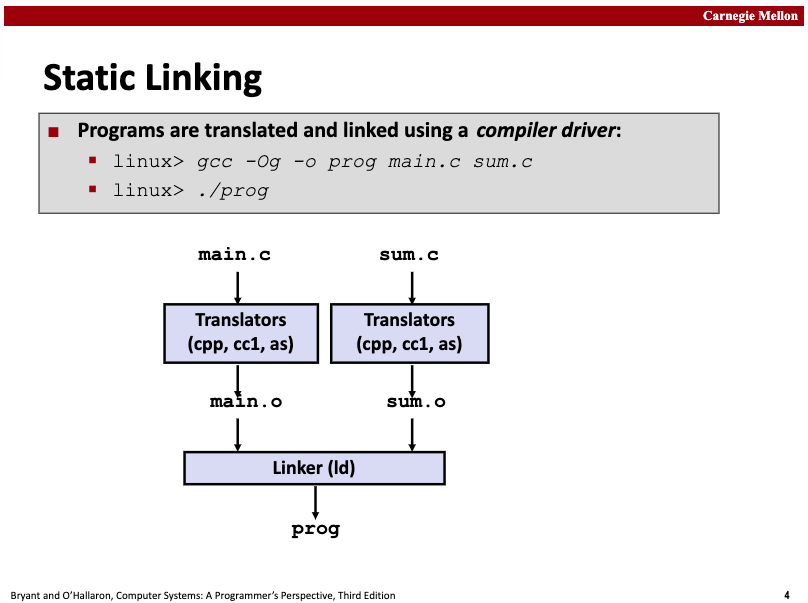

## 符号解析

每个可重定位目标模块m都有一个符号表，它包含m所定义和引用的符号的信息，在链接器上下文中，有3种不同的符号：

- 由m定义并能够被其他模块引用的全局符号；
- 由其他模块定义并能被当前模块m引用的全局符号；
- 只被模块定义和引用的本地符号（如c语言static修饰的全局函数或全局变量）；

链接器解析符号引用，指的是对于每个被引用的符号，链接器需要将这个符号与其具体的定义关联起来，如从所输入的可重定位目标文件列表中，逐一检查各重定位目标文件的符号表，找到与该符号对应的符号定义。

### 本地符号解析

对那些引用当前模块中定义的本地符号的情况，符号解析是非常简单明了的。编译器只允许每个模块中每个本地符号只有一个定义。编译器还能确保静态局部变量，它们也会有本地链接符号，拥有唯一的名字。

### 全局符号解析

但是，对于解析全局符号就棘手多了。当编译器遇到一个不是在当前模块中定义的符号的时候（可能是变量名或者函数名），它会假设该符号是在其他某个模块中定义的，编译器将为这样的每个符号都生成一个链接器符号表条目，并把它交给链接器进行处理。

链接器连接的时候会读取这个待重定位符号表，然后从所有的输入模块中查找对应的符号定义，如果某个引用符号没有找到其定义，链接器就会输出一个错误。

如果链接器找到了一个引用符号的多次重复定义（多重定义），是直接抛出错误？还是有办法知道该选择哪一个呢？这就涉及到符号的强弱规则问题。

在编译时，编译器向汇编器输出每个全局符号，或者是强（strong）或者是弱（weak），而汇编器把这个信息隐含地编码在可重定位目标文件的符号表的符号里，准确地说是记录在字段Elf_symbol.bind中。

- 强符号：(bind & global != 0) && (bind & weak == 0)
- 弱符号：bind & weak == 1

根据强弱符号的定义，Unix链接器使用下面的规则来处理多重定义的符号：

- 规则1：不允许有多个强符号
- 规则2：如果有一个强符号和多个弱符号，那么选择强符号；
- 规则3：如果有多个弱符号，那么从这些弱符号中任意选择一个；

严格遵循这些规则，就可以正确完成全局符号的解析任务。

### 与静态库链接

迄今为止，我们都是假设链接器读取一组可重定位的目标文件，并把他们链接起来，成为一个可执行文件。实际上，所有的编译系统都提供一种机制，允许将所有相关的目标模块打包成为一个单独的文件，称为**静态库**（static library），它也可以作为链接器的输入。

静态库，一种称为存档（archive）的特殊文件格式存储在磁盘中。存档文件是一组连接起来的可重定位目标文件的集合，其中每一个模块文件都有一个头部来描述其大小和位置。存档文件名由后缀.a标识。我们可以通过`ar`命令来创建静态库。如果您是用go工具对目标模块创建静态库，可通过`go tool pack`来创建。

当链接器链接输出一个可执行文件时，它只拷贝静态库里被应用程序引用的目标模块。静态库提高了常用代码的复用性，一定程度上节省了每个应用程序因为拷贝待复用模块*.o文件所带来的磁盘存储空间的浪费。

下面是一个静态链接过程的示意图：

大致含义是main2.c里面调用了vector.h中的函数，这个函数的实现在静态库文件libvector.a中，addvec实现在addvec.o中，multvec实现在multvec.o中，同时main2.c中还使用了libc的io函数，实现包含在libc.a中。现在通过静态链接（gcc -static -o prog2c main2.o ./libvector.a）构造一个完整链接的可执行程序，程序加载和运行时无需执行动态链接。

链接器会检测到addvec是在addvec.o中实现的，所以从libvector.a中只提取addvec.o来进行最后的链接，而不是也将multvec.o也链接过来，这种方式也可以节省存储空间占用。

**链接器如何使用静态库来解析引用呢？**其实这个过程很简单。

在符号解析阶段，链接器从左到右扫描在编译命令上输入的可重定位目标文件和静态库存档文件（命令上列出的.c文件会被转换为对应的.o文件），在这次扫描中，链接器维持一个可重定位目标文件的集合E（这个集合中的文件会被合并起来形成可执行文件），一个未解析的符号（引用了但是尚未定义的符号）集合U，以及一个在前面输入文件中已经定义的符号集合D。初始时，E、U、D都是空集。

- 对于命令上的每个输入文件f，链接器会判断f是一个目标文件，还是一个存档文件，如果f是一个目标文件，那么链接器会把f添加到E，修改U、D来反映f中的符号定义和引用，并继续处理下一个文件；
- 如果f是一个静态库存档文件，那么链接器就尝试匹配U中未解析的符号，看看能否在存档文件中找到对应的定义的符号。如果某个存档文件成员m，定义了一个符号来解析U中的一个符号引用，那么就将m加到E中，并且链接器修改U和D来反映m中的符号定义和引用。对存档文件中所有的成员目标文件都反复执行这个过程，直到U和D不再发生变化。在此时，任何不包含在E中的成员目标文件都简单地被丢弃，而链接器将继续处理下一个输入文件；
- 如果当链接器完成对命令上输入文件的扫描后，U是非空的，表明存在未解析成功的符号，链接器就会输出一个错误并终止。否则，它会合并并重定位E中的目标文件，从而构出完整的可执行程序文件。

这种处理方式需注意命令行上的库、目标文件的顺序，否则可能会导致符号解析失败。

关于符号重定位的问题，篇幅原因我们将在下一节链接器中进行进一步的介绍。

### 与动态库链接

前面提了静态库的一些优点，其实它也有明显的缺点，就是各个应用程序复用静态库的时候，会把自己需要的目标文件从静态库中提取出来然后和其他目标文件链接成可执行程序，相当于每个应用程序都或多或少拷贝了一部分代码，代码体积大对磁盘空间、内存空间都会造成浪费。

比如对于系统提供的io相关的库，其实没必要每个应用程序都去copy到自身，只要能实现这部分代码的引用即可。动态库就是用来解决静态库的这些不足的。

共享库（shared library），在某些系统上也称为动态链接库（DLL），在Linux下是以*.so为扩展名。共享库通过两种方式达成共享的目标：

- 首先，在文件系统中，对于一个库，只有一个.so文件，所有引用该库的可执行程序都共享这个.so文件中的代码和数据，而不是像静态库的内容那样还要被拷贝和嵌入到引用它们的可执行程序文件中；
- 其次，在内存中，一个共享库的.text section的同一个副本可以被不同的正在运行的进程共享，联想下mmap时可以指定内存区为共享还是排他性访问；

使用命令`ar`可以创建静态库，创建共享库可以使用命令gcc -shared -fPIC`来完成。

下面是一个动态链接过程的示意图：

大致含义是，main2.c中使用了vector.h中的函数，对应实现在libvector.so这个共享库中，现在是通过动态链接技术进行链接的，然后生成一个可执行程序。

这里的思路是，当创建可执行程序时，静态执行一些链接，然后在程序加载时，再进一步动态完成链接。

- 静态执行一些链接，指的是这个阶段如果有需要多个目标文件可以执行静态链接的，则执行静态链接。这个时候并没有拷贝任何共享库的代码或数据到可执行文件中，而只是拷贝了一些重定位和符号表信息，这些信息使得运行时可以解析对libvector.so中代码和数据的引用。

- 当加载器（kernel）加载和运行可执行文件时，加载部分链接的可执行文件之后，接着注意到它包含一个.interp section，这个section包含了动态链接器的路径名，动态链接器本身就是一个共享库（如在Linux上为ld-linux.so）。加载器不再像一样那样将控制直接传递给应用程序了，而是加载和运行这个动态链接器ld-linux.so。

  动态链接器会执行下面的重定位操作来完成链接任务：

  - 重定位libc.so的文本和数据到某个内存段；
  - 重定位libvector.so的文本和数据到另一个内存段；
  - 重定位可执行程序中对由libc.so和libvector.so定义的符号的引用；

  最后，动态链接器将控制传递给应用程序，从这个时候开始，共享库的位置就固定了，并且在进程执行过程中都不会改变。

关于符号重定位的问题，篇幅原因我们将在下一节链接器中进行进一步的介绍。

### 参考内容	

1. Go: Package objabi, https://golang.org/pkg/cmd/internal/objabi/

2. Go: Object File & Relocations, Vincent Blanchon, https://medium.com/a-journey-with-go/go-object-file-relocations-804438ec379b

3. Golang Internals, Part 3: The Linker, Object Files, and Relocations, https://www.altoros.com/blog/golang-internals-part-3-the-linker-object-files-and-relocations/

4. Computer System: A Programmer's Perspective, Randal E.Bryant, David R. O'Hallaron, p450-p479

   深入理解计算机系统, 龚奕利 雷迎春 译, p450-p479

5. Linker and Libraries Guide, Object File Format, File Format, Symbol Table, https://docs.oracle.com/cd/E19683-01/816-1386/chapter6-79797/index.html

6. Linking, https://slideplayer.com/slide/9505663/