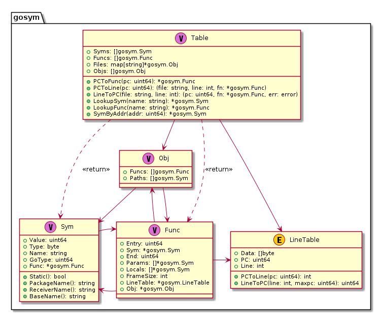

## pkg debug/gosym 应用

### 数据类型及关系

标准库提供了package `debug/gosym` 来读取go工具链为go语言生成的一些特有的section数据，如.gosymtab、.gopclntab。其为go语言运行时提供了一种高效快速的计算调用栈的方法，这在go语言出现panic希望打印堆栈信息的时候非常有帮助。

package debug/gosym中的相关重要数据结构，如下图所示：



关于go定制的.gosymtab、.gopclntab相关的符号信息设计，可以参考 [Go 1.2 Runtime Symbol Information](Go 1.2 Runtime Symbol Information, Russ Cox, https://docs.google.com/document/d/1lyPIbmsYbXnpNj57a261hgOYVpNRcgydurVQIyZOz_o/pub)，整体来看，比较重要的就是Table这个数据结构，注意到它有几个非常实用的导出方法，我们可以用来在指令地址与源文件位置之前进行快速的转换，借此可以实现一个调用栈追踪的能力。.gosymtab、.gopclntab的主要目的也是在此。

### go定制的sections

ELF文件中符号表信息一般会存储在`.symtab` section中，go程序有点特殊在go1.2及之前的版本有一个特殊的.gosymtab，其中存储了接近plan9风格的符号表结构信息，但是在go1.3之后，.gosymtab不再包含任何符号信息。

还注意到，ELF文件中行号表信息，如果是DWARF调试信息格式的话，一般会存储在debug_line或者.zdebug_line中，go程序又有点特殊，它还存在一个名为`.gopclntab`的section，其中保存了go程序的行号表信息。

那么，go为什么不使用.debug/.zdebug前缀的sections呢？为什么要独立添加一个.gosymtab、.gopclntab呢？这几个section有什么区别呢？

我们很确定的是.debug/.zdebug前缀开头的sections中包含的是调试信息，是给调试器等使用的，.gosymtab、.gopclntab则是给go运行时使用的。go程序执行时，其运行时部分会加载.gosymtab、.gopclntab的数据到进程内存中，用来执行栈跟踪（stack tracebacks），比如runtime.Callers，.symtab、.debug/.zdebug sections并没有被加载到内存中，它是由外部调试器来读取并加载的，如gdb、delve。

可能会有疑问，为什么go程序不直接利用.symtab、.debug/.zdebug sections呢，这几个sections中的数据结合起来也足以实现栈跟踪？

目前我了解到的是，DWARF数据的解析、使用应该会更复杂一点，go早期核心开发者很多有Plan9的工作经验，在研发Plan9时就已经有了类似pclntab的尝试，从Plan9的man手册中可以查看到相关的信息。

**Plan9's man a.out**

```bash
NAME
    a.out - object file format

 SYNOPSIS
    #include <a.out.h>

DESCRIPTION
    An executable Plan 9 binary file has up to six sections: a
    header, the program text, the data, a symbol table, a PC/SP
    offset table (MC68020 only), and finally a PC/line number
    table.  The header, given by a structure in <a.out.h>, con-
    tains 4-byte integers in big-endian order:

   ....

   A similar table, occupying pcsz-bytes, is the next section
   in an executable; it is present for all architectures.  The
   same algorithm may be run using this table to recover the
   absolute source line number from a given program location.
   The absolute line number (starting from zero) counts the
   newlines in the C-preprocessed source seen by the compiler.
   Three symbol types in the main symbol table facilitate con-
   version of the absolute number to source file and line num-
   ber:
```

go程序的很多核心开发者本身就是Plan9的开发者，go中借鉴Plan9的经验也就不足为奇了，早期pclntab的存储结构与plan9下程序的pclntab很接近，但是现在已经差别很大了，可以参考go1.2 pclntab的设计proposal：[Go 1.2 Runtime Symbol Information](https://docs.google.com/document/d/1lyPIbmsYbXnpNj57a261hgOYVpNRcgydurVQIyZOz_o/pub)。

> TODO ps: 另外提一下，cgo程序中，似乎是没有.gosymtab、.gopclntab的。

通过package `debug/gosym`可以构建出pcln table，通过其方法PcToLine、LineToPc等，可以帮助我们快速查询指令地址与源文件中位置的关系，也可以通过它来进一步分析调用栈，如程序panic时我们希望打印调用栈来定位出错的位置。

我理解，对调用栈信息的支持才是.gosymtab、.gopclntab所主要解决的问题，go1.3之后调用栈数据应该是完全由.gopclntab支持了，所以.gosymtab也就为空了。所以它和调试器需要的.debug/.zdebug_frame有着本质区别，后者不但可以追踪调用栈信息，也可以追踪每一个栈帧中的寄存器数据的变化，其数据编码、解析、运算逻辑也更加复杂。

那.gosymtab、.gopclntab能否用于调试器呢？也不能说完全没用，只是这里面的数据相对DWARF调试信息来说，缺失了一些调试需要的信息，我们还是需要用到DWARF才能完整解决调试场景中的问题。

现在我们应该清楚package debug/gosym以及对应.gosymtab、.gopclntab sections的用途了，也应该清楚与.symtab以及调试相关的.debug/.zdebug_这些sections的区别了。 

### 常用操作及示例

这是我们的一个测试程序 testdata/loop2.go，我们先展示下其源文件信息，接下来执行`go build -gcflags="all=-N -l" -o loop2 loop2.go`将其编译成可执行程序loop2，后面我们读取loop2并继续做实验。

#### PC与源文件互转

**testdata/loop2.go：**

```go
     1  package main
     2  
     3  import (
     4      "fmt"
     5      "os"
     6      "time"
     7  )
     8  
     9  func init() {
    10      go func() {
    11          for {
    12              fmt.Println("main.func1 pid:", os.Getpid())
    13              time.Sleep(time.Second)
    14          }
    15      }()
    16  }
    17  func main() {
    18      for {
    19          fmt.Println("main.main pid:", os.Getpid())
    20          time.Sleep(time.Second * 3)
    21      }
    22  }
```

下面我们通过`debug/gosym`来写个测试程序，目标是实现虚地址pc和源文件位置、函数之间的转换。

**main.go：**

````go
import (
    "debug/elf"
	"debug/gosym"
)

func main() {
    if len(os.Args) != 2 {
		fmt.Fprintln(os.Stderr, "usage: go run main.go <prog>")
		os.Exit(1)
	}
	prog := os.Args[1]

	// open elf
	file, err := elf.Open(prog)
	if err != nil {
		panic(err)
	}
    
	gosymtab, _ := file.Section(".gosymtab").Data()
	gopclntab, _ := file.Section(".gopclntab").Data()

	pclntab := gosym.NewLineTable(gopclntab, file.Section(".text").Addr)
	table, _ := gosym.NewTable(gosymtab, pclntab)

	pc, fn, err := table.LineToPC("/root/debugger101/testdata/loop2.go", 3)
	if err != nil {
		fmt.Println(err)
	} else {
		fmt.Printf("pc => %#x\tfn => %s\n", pc, fn.Name)
	}
	pc, fn, _ = table.LineToPC("/root/debugger101/testdata/loop2.go", 9)
	fmt.Printf("pc => %#x\tfn => %s\n", pc, fn.Name)
	pc, fn, _ = table.LineToPC("/root/debugger101/testdata/loop2.go", 11)
	fmt.Printf("pc => %#x\tfn => %s\n", pc, fn.Name)
	pc, fn, _ = table.LineToPC("/root/debugger101/testdata/loop2.go", 17)
	fmt.Printf("pc => %#x\tfn => %s\n", pc, fn.Name)

	f, l, fn := table.PCToLine(0x4b86cf)
	fmt.Printf("pc => %#x\tfn => %s\tpos => %s:%d\n", 0x4b86cf, fn.Name, f, l)
}
````

运行测试`go run main.go ../testdata/loop2`，注意以上程序中指定源文件时使用了绝对路径，我们将得到如下输出：

```bash
$ go run main.go ../testdata/loop2
no code at /root/debugger101/testdata/loop2.go:3
pc => 0x4b86cf  fn => main.init.0.func1
pc => 0x4b8791  fn => main.init.0.func1
pc => 0x4b85b1  fn => main.main
pc => 0x4b86cf  fn => main.init.0.func1 pos => /root/debugger101/testdata/loop2.go:9
```

在上述测试程序中，我们一开始指定了一个源文件位置loop2.go:3的位置，查看源码可知，这个位置处是一些import声明，没有函数，所以这里找不到对应的指令，所以才会返回错误信息“no code at ....loop2.go:3”。剩余几行测试都指定了有效的源码位置，分别输出了几个源文件位置。

然后我们从输出的结果中选择第一个的pc值0x4b86cf作为table.PCToLine(...)的参数，用于测试从pc转换为源文件位置，程序也正确输出了源文件位置信息。

#### 运行时栈跟踪

go程序出了通过error来传播错误，还有一种方式是通过panic来传播异常，由于panic传播路径可能会比较长，直到它被当前goroutine recover或者进程crash。

当出现panic时，如果我们主动recover了，也会希望通过打印调用栈来追踪问题的源头；如果没有recover导致进程crash了，那么运行时也会打印每个goroutine的调用栈信息。两种方式的目的都是为了帮助我们容易定位panic的源头位置。

下面是一个延时go程序panic时recover并打印调用栈信息的示例：

**main.go**

```go
1  package main
2  
3  import (
4      "runtime/debug"
5  )
6  
7  func main() {
8      defer func() {
9          if e := recover(); e != nil {
10              debug.PrintStack()
11          }
12      }()
13      f1()
14  }
15  
16  func f1() {
17      f2()
18  }
19  
20  func f2() {
21      panic("let's panic")
22  }
```

运行`go run main.go`进行测试：

```bash
$ go run main.go

goroutine 1 [running]:
runtime/debug.Stack(0xc00001408b, 0x8, 0xc000096df0)
	/usr/local/go/src/runtime/debug/stack.go:24 +0x9f
runtime/debug.PrintStack()
	/usr/local/go/src/runtime/debug/stack.go:16 +0x25
main.main.func1()
	/Users/zhangjie/main.go:10 +0x45
panic(0x1084480, 0x10aff40)
	/usr/local/go/src/runtime/panic.go:969 +0x175
main.f2(...)
	/Users/zhangjie/main.go:21
main.f1(...)
	/Users/zhangjie/main.go:17
main.main()
	/Users/zhangjie/main.go:13 +0x5d
```

上述调用栈信息如何看呢：

- 首先从上往下看，runtime/debug.Stack->runtime/debug.PrintStack->main.main.func1，这里是panic被recover的位置；
- 继续往下看，可以看到panic在何处生成的，panic->main.f2，注意到这个函数第21行调用了panic方法，找到panic发生的位置了；
- 调用栈剩下的就没有必要看了；

前面我们不止一次提到go运行时调用栈信息是基于.pclntab构建出来的，but how？

#### 栈跟踪如何实现

栈跟踪（stack unwinding）如何实现呢，我们先来说下一般性的思路：

- 首先获取当前程序的pc信息，pc确定了就可以确定当前函数f对应的栈帧；
- 再获取当前程序的bp信息（go里面称为fp），进而可以拿到函数返回地址；
- 返回地址往往就是在caller对应的函数ff的栈帧中了，将该返回地址作为新的pc；
- 重复前面几步，直到栈跟踪深度达到要求为止；

**go runtime如何利用.gopclntab实现栈跟踪？**

要理解这点首先应该理解.gopclntab的设计，这部分内容可以参考[Go 1.2 Runtime Symbol Information](https://docs.google.com/document/d/1lyPIbmsYbXnpNj57a261hgOYVpNRcgydurVQIyZOz_o/pub)，然后我们可以看下实现，即gosym.Table及相关类型的结构。

在本文开头我们已经展示了gosym package的类图，从中我们可以看到Table表结构包含了很多Syms、Funcs、Files、Objs，进一步结合其暴露的Methods不难看出，我们可以轻松地在pc、file、lineno、func之间进行转换。

但是调用栈是什么？调用栈是一系列方法调用的caller-callee关系，这个Table里面可没有，它只是用来辅助查询的。

- 如果要获得调用栈，首先你要能拿到goroutine当前的pc值，这个go runtime肯定可以拿到，有了pc我们就可以通过gosym.Table找到当前函数名；
- 然后我们需要知道当前函数调用的返回地址，那就需要通过go runtime获得bp（go里面称之为fp），通过它找到存放返回地址的位置，拿到返回地址；
- 返回地址绝大多数情况下都是返回到caller对应的函数调用中（除非尾递归优化不返回，但是go编译器不支持尾递归优化，所以忽略），将这个返回地址作为pc，去gosym.Table中找对应的函数定义，这样就确定了一个caller；
- 重复上述过程即可直到符合unwind深度要求。

go标准库`runtime/debug.PrintStack()`就是这么实现的，只是它考虑的更周全，比如打印所有goroutine调用栈需要STW，调用栈信息过大可能超出goroutine栈上限，所以会先切到systemstack再生成调用栈信息，会考虑对gc的影响，等等。

**调试器如何利用.gopclntab实现栈跟踪？**

根据前面对gosym.Table的分析，我们很容易明白，如果只是单纯利用.gopclntab来实现stack unwinding，那是不可能的。而且调试器里面也很难像go runtime那样灵活自如地对goroutine进行控制，如获取goroutine的各种上下文信息。

那调试器应该如何做呢？

研究delve源码发现，在[go-delve/delve@913153e7](https://sourcegraph.com/github.com/go-delve/delve@913153e7ffb62512ccdf850bc37bf3abd3aecc2b/-/blob/pkg/proc/stack.go?subtree=true#L115)及之前的版本中是借助gosym.Table结合DWARF FDE实现的：

- dlv首先利用DWARF .debug_frame section来构建FDE列表；

- dlv获得tracee的pc值，然后遍历FDE列表，找到FDE地址范围覆盖pc的FDE，这个FDE就是对应的函数栈帧了；
- 然后再找caller，此时dlv再获取bp值，再计算出返回地址位置，再读取返回地址，然后再去遍历FDE列表找地址范围覆盖这个返回地址的FDE，这个FDE对应的就是caller；
- 重复以上过程即可直到符合unwind深度要求；

找caller-callee关系，dlv是这么处理的，找对应的函数名、源文件位置信息，还是通过gosym.Table来实现的。

其实这里go-delve/delve的实现走了一点“捷径”，本来它可以通过.debug_line来实现pc和file:lineno的转换，也可以通过.debug_frame来确定调用栈。

这里需要明确的是，.gopclntab只记录了纯go程序的pc、源文件位置映射信息，对于cgo程序的部分是不会相关信息的，因为调用的c编译器都不理解有这些东西的，就有一定的局限性。但是生成.debug_line信息，常见编译器都是支持的，是可以更好地解决这里的局限性问题的。

[go-delve/delve@6d405179](https://sourcegraph.com/github.com/go-delve/delve@6d405179/-/blob/pkg/proc/stack.go?subtree=true#L113)，项目核心开发aarzilli解决了这个问题，并在提交记录里特别强调了这个问题：

```bash
commit 6d40517944d40113469b385784f47efa4a25080d
Author: aarzilli <alessandro.arzilli@gmail.com>
Date:   Fri Sep 1 15:30:45 2017 +0200

	proc: replace all uses of gosymtab/gopclntab with uses of debug_line
    
    gosymtab and gopclntab only contain informations about go code, linked
    C code isn't there, we should use debug_line instead to also cover C.
    
    Updates #935
```

ok，这里大家应该明白实现原理了，我们将在下一章调试器开发过程中加以实践。

### 参考内容

1. How to Fool Analysis Tools, https://tuanlinh.gitbook.io/ctf/golang-function-name-obfuscation-how-to-fool-analysis-tools

2. Go 1.2 Runtime Symbol Information, Russ Cox, https://docs.google.com/document/d/1lyPIbmsYbXnpNj57a261hgOYVpNRcgydurVQIyZOz_o/pub

3. Some notes on the structure of Go Binaries, https://utcc.utoronto.ca/~cks/space/blog/programming/GoBinaryStructureNotes

4. Buiding a better Go Linker, Austin Clements, https://docs.google.com/document/d/1D13QhciikbdLtaI67U6Ble5d_1nsI4befEd6_k1z91U/view


5.  Time for Some Function Recovery, https://www.mdeditor.tw/pl/2DRS/zh-hk