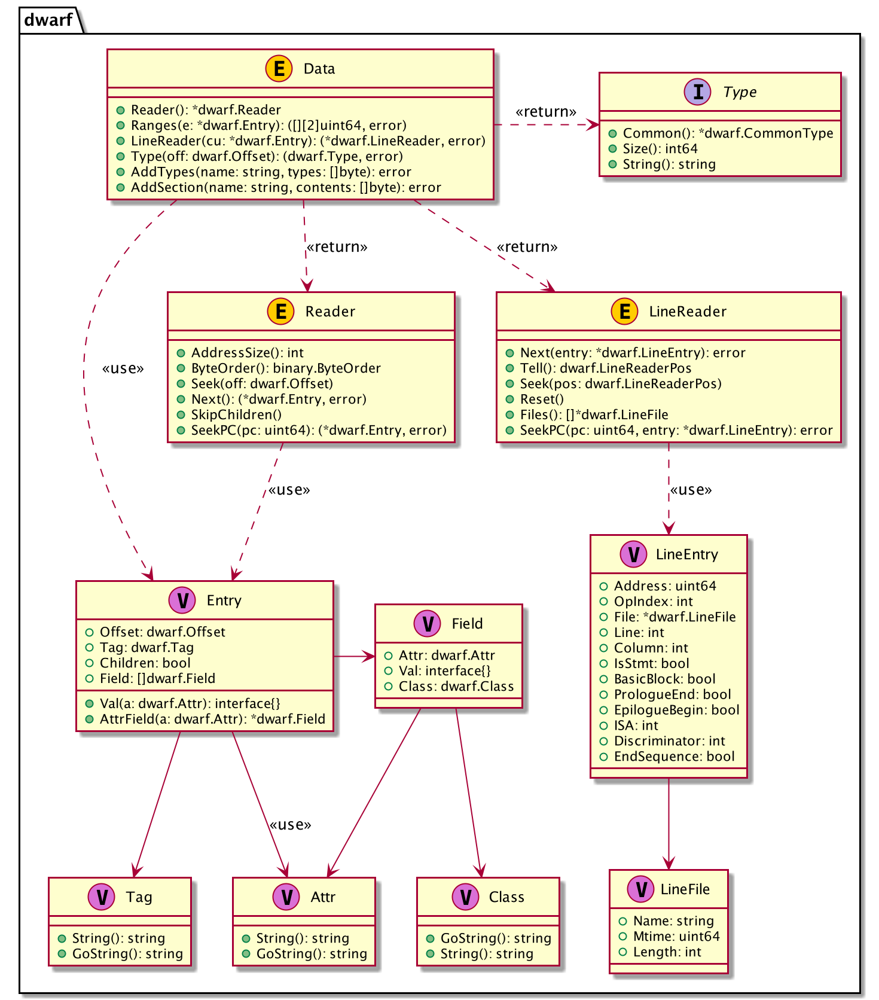

## pkg debug/dwarf 应用

### 数据类型及关系

标准库提供了package `debug/dwarf` 来读取go工具链为外部调试器生成的一些DWARF数据，如.debug_info、.debug_line等等。

注意go生成DWARF调试信息时，可能会考虑减少go binary尺寸，所以会对DWARF信息进行压缩后，再存储到不同的section中，比如开启压缩前，描述types、variables、function定义的未压缩的.debug_info数据，开启压缩压缩后的数据将被保存到.zdebug_info中，其他几个调试用section类似。在读取调试信息需要注意一下。

package debug/dwarf中的相关重要数据结构，如下图所示：



当我们打开了一个elf.File之后，便可以读取DWARF数据，当我们调用elf.File.Data()时便可以返回读取、解析后的DWARF数据，接下来便是在此基础上进一步读取DWARF中的各类信息，以及与对源码的理解结合起来。

### 常用操作及示例

#### 打开一个elf文件

#### 读取dwarf数据

#### 读取编译单元信息

#### 读取行号表信息

#### 读取调用栈信息

#### 读取符号信息表

Dwarf v2 aims to solve how to represent the debugging information of all programming languages, there’s too much to introduce it. Dwarf debugging information may be generated and stored into many debug sections, but in package debug/dwarf, only the following debug sections are handled:

1)    .debug_abbrev

2)    .debug_info

3)    .debug_str

4)    .debug_line

5)    .debug_ranges

6)    .debug_types

 

1)    const.go, it defines the constansts defined in Dwarf, including constants for tags, attributes, operation, etc.

2)    entry.go, it defines a DIE parser, type *dwarf.Entry* abstracts a DIE entry including 3 important members, Tag(uint32), Field{Attr,Val,Class}, Children(bool).

It defines a DIE Reader for traversing the .debug_info which is constructed as a DIE tree via:

```go
f, e := elf.Open(elf)
dbg, e := f.DWARF()
r := dbg.Reader()

for {
	entry, err := r.Next()

	if err != nil || entry == nil {
		break
	}

	//do something with this DIE*
	//…
}
```

3)    line.go, each single compilation unit has a .debug_line section, it contains a sequence of LineEntry structures. In line.go, a LineReader is defined for reading this sequence of LineEntry structures.

`func (d \*dwarf.Data) LineReader(cu \*Entry) (\*LineReader, error)`, the argument must be a DIE entry with tag TagCompileUnit, i.e., we can only get the LineReader from the DIE of compilation unit.

```go
f, e := elf.Open(elf)
dbg, e := f.DWARF()
r := dbg.Reader()

for {
	entry, _ := r.Next()
	if err != nil || entry == nil {
		break;
	}

	// read the line table of this DIE

	lr, _ := dbg.LineReader(entry)
	if lr != nil {
		le := dwarf.LineEntry{}
		for {
			e := lr.Next(&le)
			if e == io.EOF {
				break;
			}
		}
	}
}
```

4)    type.go, Dwarf type information structures.

5)    typeunit.go, parse the type units stored in a Dwarf v4 .debug_types section, each type unit defines a single primary type and an 8-byte signature. Other sections may then use formRefSig8 to refer to the type.

6)    unit.go, Dwarf debug info is split into a sequence of compilation units, each unit has its own abbreviation table and address size.

### 

参考内容：

1. How to Fool Analysis Tools, https://tuanlinh.gitbook.io/ctf/golang-function-name-obfuscation-how-to-fool-analysis-tools

2. Go 1.2 Runtime Symbol Information, Russ Cox, https://docs.google.com/document/d/1lyPIbmsYbXnpNj57a261hgOYVpNRcgydurVQIyZOz_o/pub

3. Some notes on the structure of Go Binaries, https://utcc.utoronto.ca/~cks/space/blog/programming/GoBinaryStructureNotes

4. Buiding a better Go Linker, Austin Clements, https://docs.google.com/document/d/1D13QhciikbdLtaI67U6Ble5d_1nsI4befEd6_k1z91U/view


5.  Time for Some Function Recovery, https://www.mdeditor.tw/pl/2DRS/zh-hk